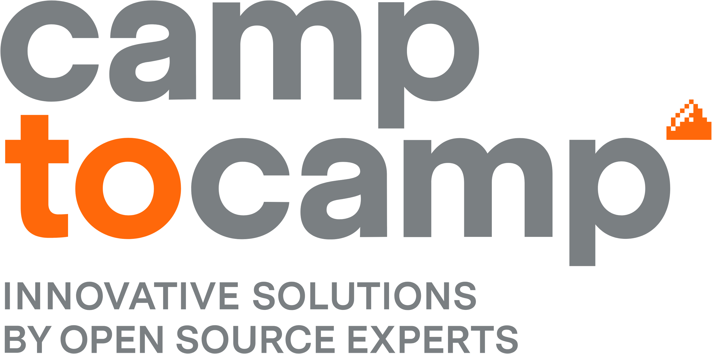

<p align="center">
  &nbsp;&nbsp;&nbsp;&nbsp;
  &nbsp;&nbsp;&nbsp;&nbsp;
  &nbsp;&nbsp;&nbsp;&nbsp;
  
</p>

# Mergin Maps Community Edition, hands-on workshop

QGIS user meeting, Laax. Mergin Maps is built by Lutra Consulting, the workshop by Camptocamp.

Run your own Mergin Maps server on your laptop, push a QGIS project to it, survey as a field user, pull the edits back. Everything on `localhost`, no phone, no Wi-Fi needed once the images are pulled.

## Prerequisites

Install before the session and make sure every check below passes. Without them it will be a long day.

### Everyone

- **git**
- **openssl**, to generate two secrets
- **QGIS 3.34 or newer** with the Mergin Maps plugin (installable from the QGIS plugin manager, or from the zip on the trainer's stick)
- **Python 3.9 or newer** with `venv` and `pip`, for the client CLI module
- about **3 GB** free disk for Docker images and data

### Linux

- **Docker Engine** with the **compose plugin**: `docker compose version` must answer, and `docker ps` must work without `sudo` (your user in the `docker` group)
- the **Mergin Maps Linux build**, a zip handed out by the trainer, see `workshop/linux-app/README.md`

### Windows

- **Docker Desktop** with the **WSL 2 backend** and an **Ubuntu** distribution, WSL integration ticked for that distribution in Docker Desktop settings
- every command of the workshop runs in the **Ubuntu (WSL) terminal**, never in PowerShell, and the repository is cloned inside the WSL home, never under `/mnt/c`
- the **Mergin Maps desktop app** for Windows, `merginmaps-2026-4-0-win64.exe` from https://github.com/MerginMaps/mobile/releases

### Check

```sh
git --version
docker --version
docker compose version
docker ps
openssl version
python3 --version
```

Every line must answer. QGIS opens.

## Get the files

```sh
mkdir -p ~/workshop_mm_laax && cd ~/workshop_mm_laax
git clone https://github.com/julsbreakdown/laax_mm_ws.git laax
```

```
laax/
  docker/       the Mergin Maps server stack: docker-compose.yml, .env.template
  common/       nginx config, entrypoint, permissions script, optional Grafana stack
  dbsync/       PostGIS + db-sync stack for the last module
  workshop/     users CSV, Linux app launcher, ready-made QGIS project
```

The decks are handed out as PDF. Start with `01-get-the-server.pdf`.

Every command of the day is in `COMMANDS.txt`, in order: copy and paste instead of typing.
